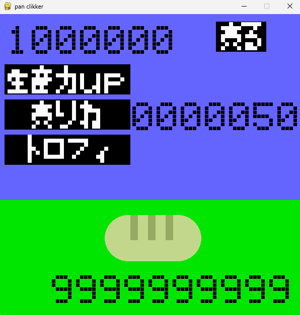

kurikka-.pyでクリッカーゲームを起動できる。

パンをクリックすると生産することができ、左上の数字が増える。

右上にある売るを押せば、生産したパンを売ることができる。

所持金は下の数字で、最初は5円ずつ増える。

生産力upや売りね、トロフィにマウスを合わせれば、必要なお金が表示される。

必要なお金なので、生産したパンではないことには注意。

このゲームの目標はトロフィを買うこと。

